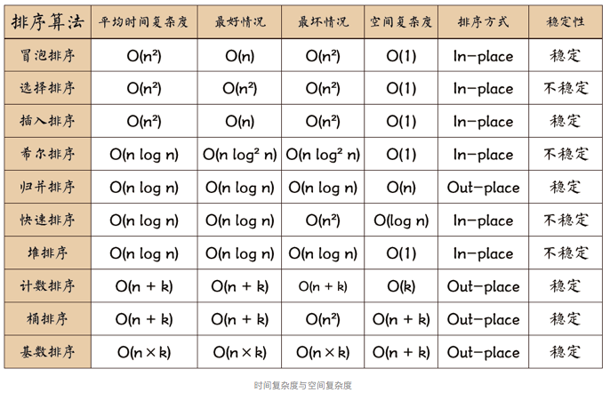

## 十大排序

> Chan 2019/12/25

<h4 style="color:bule;">排序算法复杂度</h4>

- 稳定性

对于简单数字排序排列，稳定性是没有意义的。但是待排序序列有多个属性，初始的顺序是有意义的，那么保持稳定性是很重要的。

- 内部排序和外部排序

内部排序是指，待排序列放在内存中，数据量比较小。比较次数来标志效率。

外部排序是指，待排序列很大，放在外存中。用IO次数来标志效率。

#### 算法特点与一般使用情形

各个算法各有各的特点，需要针对不同问题选择不同的算法。

最好熟练掌握的有：**插入排序**、**希尔排序**、**快速排序**、**堆排序**、**归并排序**。他们都是基于比较的排序方法，适合一切分布的数据。

基数排序、桶排序、计数排序是外部排序，且为非比较排序。对数据分布有一定要求。

**内部排序**

- 插入排序——小样本

适合小样本序列（千以下），简单好写。并且稳定。希尔排序是插入排序的升级版，运用了间隔递减的思想，将序列分为多组来插入排序，但是不稳定。

- 快速排序——无序大样本

适合大规模的数据，速度很快。商业软件排序API大多选择这种排序方法。实际应用中的老大。

当序列高度有序时，不适合用快速排序。序列随机分布是，快排最佳。

当系统对时间敏感，不用快速排序，除非能承受o(n^2)的代价。

- 堆排序——大样本

时间效率和快排、归并排序相同，但是辅助空间需要只有o(1),唯一一个。

时间复杂度稳定，不受序列影响，都是o(nlogn)。

堆的时间主要花费在建立在堆的过程中，所以堆的最大的唯一的缺点，数据变化频繁时（增删改），堆的维护很麻烦。

堆很适合找出大量数据中的最大/最小的一批数据。

**外部排序——一般都是大样本**

- 归并排序

一般用在，外部排序中。

效率和快排，堆排一样。但归并排序是稳定的。

特别适合片段有序。

- 计数排序

需要占用大量空间，适合数据分布集中的情形。

- 桶排序

最大最小相差要比较大，适合数据分布均匀，数据集中，会导致数据集中在一个“桶”中。

- 基数排序

可以理解为一种排序思想——多关键字排序，比如个十百位比较。需要利用其他排序方法。

#### 外部排序——归并排序详解

